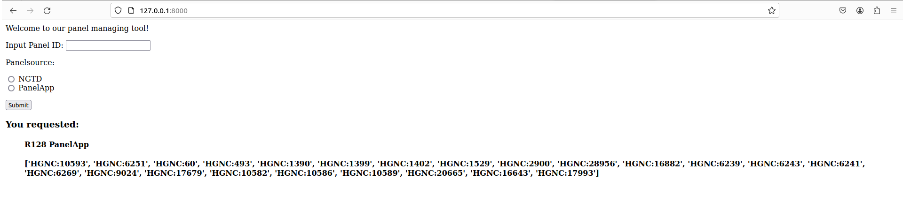

## How to start


The frontend is a webpage run from a local server that will allow the user to interact with the tool with minimal use of the commandline.

The server can be started with one of two modalities. 

### Running from the frontend folder 

The following command allows for the frontend to be accessed at http://127.0.0.1:8000/ :

```
python manage.py runserver 8000
```


### Running from the root folder 

The following commands can be used to run the frontend through the root directory.

First build the docker

```
docker build -t test_docker .
```


Then run the following command :

```
docker run -p 8000:8000 -v $(pwd):/code test_docker python frontend/manage.py runserver 0.0.0.0:8000
```


Both methods will start the frontend locally at http://127.0.0.1:8000/


## Clicking the link will take the user to a webpage


An R code can be entered into the input Panel ID text box.

Clicking the NGTD option will return information on the panel


Clicking the PanelApp option will return the HGNC IDs for genes in the panel



To close the server you can type ctrl + C on the command line.

## What are the inputs and outputs

The user interfaces has a text field where the user can input the panel ID. The user then selects the panel source (NGTD or PanelApp). If the panelID is innapropriate to query panelApp the message returned in the front end will be "Was not able to return Gene Panel"


On clicking submit either the NGTD targeted genes entry or the PanelApp HGNC IOs will be displayed. 

The NGTD targeted genes entry is only queriable through the root directory method currently. This functionality will be completely removed as the NGTD targeted genes entry was discussed and found to not provide value. 
