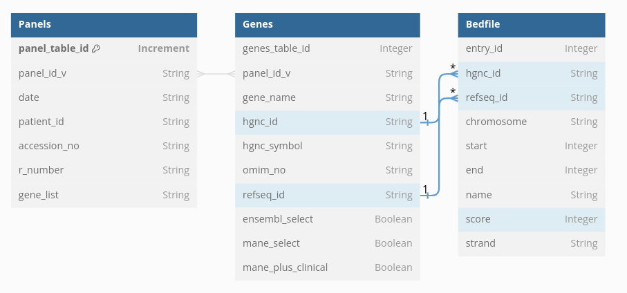
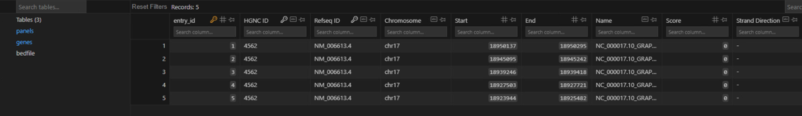

## Running database ##

**Table information**

There are three tables in the database:

    - Panels: Represents panel data for each patient
    - Genes: Represents gene data for each available panel
    - Bedfile: Represents data needed to create a genomic BED file

The Panel table gathers the following information:

    - panel_table_id (int): Primary key identifier for the case entry
    - panel_id_v (Str): The RCode_panelID_panelversion of the panel run
    - date (Str): The date the case was analysed
    - patient_id (Str): The unique patient ID assigned to in-house
    - accession_no (Str): The unique ID associated with this test
    request
    - r_number (Str): The genomic test directory R number assoicated with
    this test request
    - gene_list (Str): The List of Genes included in the panel

The Genes table gathers the following information:

    - genes_table_id (int): Primary key identifier for the genes table
    - panel_id_v (Str): The RCode_panelID_panelversion of the panel run
    - gene_name (Str): Gene Name
    - hgnc_id (Str): HUGO Gene Nomenclature Committee ID for the gene
    - hgnc_symbol(Str): HGNC approved Gene Symbol
    - omim_no (Str): OMIM Number
    - refseq_id (Str): Transcript ID
    - ensembl_select (bool): True/False whether transcript is ensembl
    select
    - mane_select (bool): True/False whether transcript is mane
    select
    - mane_plus_clinical (bool): True/False whether transcript is
    mane plus clinical

The Bedfile table gathers the following information:

    - entry_id (int): Primary key identifier for the BED file entry.
    - hgnc_id (int): HGNC (HUGO Gene Nomenclature Committee) identifier.
    - chromosome (str): Chromosome on which the genomic region is
    located.
    - start (int): Starting position of the genomic region.
    - end (int): Ending position of the genomic region.
    - name (str): Name or identifier associated with the entry.
    - score (int): Score associated with the entry.
    - strand (str): Strand direction of the genomic region.

**Making the table**

Running the following commands will build the database

python3 src/database/panel_db_2.py

The database auto-generates into where the code is excecuted from
in this case the root folder.

**Pushing data to the table**

Running the following commands will push info to the database

python3 src/database/genes_to_database.py
python3 src/database/panels_to_database.py
python3 src/database/bedfile_to_database.py

The paths to the data created will need to be edited in the script.

**Viewing the database**

Install sqliteviewer to respective IDE to view database.

## Example ##

Here is a visual example of the database schema

Here is a visual example of the database in sqlviewer

