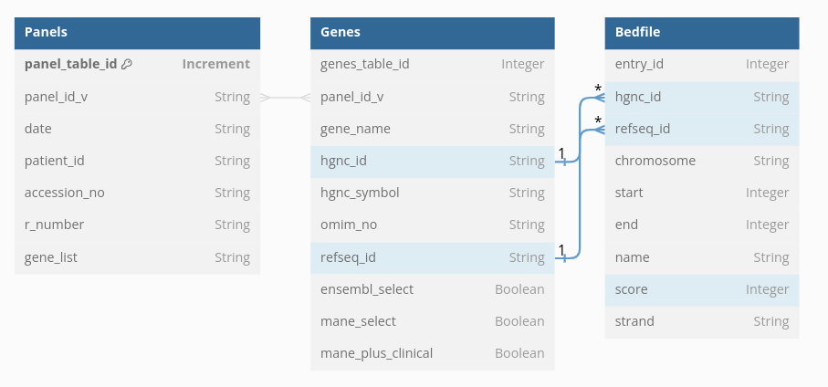

dbdiagram.io code 
Table Panels {
  panel_table_id Increment [primary key]
  panel_id_v String
  date String
  patient_id String
  accession_no String
  r_number String
  gene_list String
}

Table Genes {
  genes_table_id Integer
  panel_id_v String
  gene_name String
  hgnc_id String
  hgnc_symbol String
  omim_no String
  refseq_id String
  ensembl_select Boolean
  mane_select Boolean
  mane_plus_clinical Boolean
}

Table Bedfile {
  entry_id Integer
  hgnc_id String
  refseq_id String
  chromosome String
  start Integer
  end Integer
  name String
  score Integer
  strand String
}

Ref: Panels.panel_id_v <> Genes.panel_id_v // many-to-many
Ref: Genes.refseq_id < Bedfile.refseq_id
Ref: Genes.hgnc_id < Bedfile.hgnc_id
